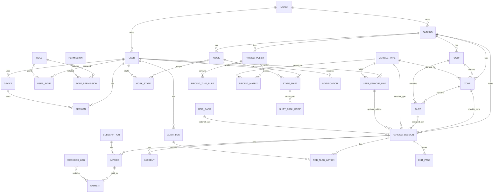

# 02. Domain Model Proposal

This is a design proposal only. Do not treat it as implemented code. Existing auth/session entities should not be broken; extend around them conservatively.

## SaaS / Identity

| Entity | Table | Tenant Scoped? | Key Fields | Relations | Why Needed | Phase |
|---|---|---|---|---|---|---|
| Tenant | `tenants` | Global | `id`, `name`, `slug`, `email_contact`, `status`, `is_deleted` | Owns users and core tables | Existing SaaS tenant root | PHASE_0_FOUNDATION |
| User | `users` | Yes via `tenant_id` except system admin convention needs care | `username`, `password`, `full_name`, `phone`, `status`, `created_by` | Tenant, roles, sessions, devices | Internal accounts for manager/staff/user | PHASE_0_FOUNDATION |
| Role | `roles` | Global | `name`, `desc` | RolePermission, UserRole | Existing global RBAC roles | PHASE_0_FOUNDATION |
| Permission | `permissions` | Global | `name`, `scope`, `module`, `resource`, `action` | RolePermission | Fine-grained authorization | PHASE_0_FOUNDATION |
| Device | `devices` | Indirect via user | `fingerprint`, `label`, `status`, `approved_by`, `approved_at`, `expires_at` | User, Session | Existing device allow-list | PHASE_1_CRUD_BASIC |
| Session | `sessions` | Indirect via user | `user_id`, `device_id`, `refresh_jti`, `revoked_at`, `expired_at` | User, Device | Existing login/session lifecycle | PHASE_0_FOUNDATION |
| DeviceApprovalRequest | `device_approval_requests` | Yes direct `tenant_id` | `user_id`, `device_id`, `requested_at`, `status`, `approved_by`, `expires_at`, `mode` | User, Device, Manager | Needed to model temporary approval, audit manager decision, and avoid overloading `Device` | PHASE_1_CRUD_BASIC |

## Facility

| Entity | Table | Tenant Scoped? | Key Fields | Relations | Why Needed | Phase |
|---|---|---|---|---|---|---|
| Parking | `parkings` | Yes | `code`, `name`, `address`, `status`, `total_capacity` | Tenant, floors, zones, slots | Existing building/parking root | PHASE_1_CRUD_BASIC |
| Floor | `floors` | Yes | `parking_id`, `code`, `name`, `display_order`, `is_active`, `is_deleted` | Parking, zones, slots | Existing floor hierarchy | PHASE_1_CRUD_BASIC |
| Zone | `zones` | Yes | `parking_id`, `floor_id`, `vehicle_type_id`, `code`, `name`, `capacity`, `status` | Parking, Floor, VehicleType, Slots | Existing zone/type/capacity grouping | PHASE_1_CRUD_BASIC |
| Slot | `slots` | Yes | `parking_id`, `floor_id`, `zone_id`, `code`, `slot_number`, `status` | Parking, Floor, Zone, ParkingSession | Existing physical slot | PHASE_1_CRUD_BASIC |
| Kiosk/Gate | `kiosk` plus possible `gates` | Yes | `parking_id`, `code`, `name`, `status`, `last_heartbeat_at` | Parking, KioskStaff, Device binding | Existing kiosk entity; gate may be separate if entry/exit barrier matters | PHASE_1_CRUD_BASIC |

## Master Data

| Entity | Table | Tenant Scoped? | Key Fields | Relations | Why Needed | Phase |
|---|---|---|---|---|---|---|
| VehicleType | `vehicle_types` | Global | `code`, `name`, `is_active`, `is_deleted` | Zone, ParkingSession, UserVehicleLink, PricingMatrix | Existing global vehicle type. If tenant-specific pricing is needed, keep pricing tenant-scoped instead of duplicating types. | PHASE_1_CRUD_BASIC |
| VehicleCategory | `vehicle_categories` | Global or MISSING | `code`, `name`, `parent/category type` | VehicleType | Only needed if owner distinguishes category from type; currently MISSING. | PHASE_LATER |

## Operations

| Entity | Table | Tenant Scoped? | Key Fields | Relations | Why Needed | Phase |
|---|---|---|---|---|---|---|
| ParkingSession | `parking_sessions` | Yes | `parking_id`, `zone_id`, `slot_id`, `vehicle_type_id`, `license_plate`, `check_in_at`, `check_out_at`, `status`, `entry_image_url`, `exit_image_url`, `total_amount` | Parking, Zone, Slot, VehicleType, UserVehicleLink, Invoice, StaffShift | Existing session entity; needs service/controller. | PHASE_2_OPERATION |
| ParkingCard | `parking_cards` or extend `rfid_cards` | Yes | `code`, `uid`, `status`, `current_session_id`, `qr_token` | ParkingSession | Spec uses physical card like `CARD-001`; current `RfidCard` is close but seems assigned to user, so semantics need owner decision. | PHASE_2_OPERATION |
| Vehicle | `vehicles` or keep `user_vehicle_link` | Yes | `license_plate`, `vehicle_type_id`, `normalized_plate` | User/Driver, ParkingSession | Current `UserVehicleLink` covers registered user vehicles but walk-in vehicles may need separate vehicle identity. | PHASE_2_OPERATION |
| PlateAlias / FuzzyPlateMatch | `plate_aliases` or computed only | Yes | `raw_plate`, `normalized_plate`, `session_id`, `confidence` | ParkingSession | Needed for fuzzy plate search and wrong-plate recovery. | PHASE_2_OPERATION |
| SlotAssignmentHistory | `slot_assignment_history` | Yes | `session_id`, `from_slot_id`, `to_slot_id`, `actor_user_id`, `reason`, `occurred_at` | ParkingSession, Slot, User | Needed for move vehicle/slot override audit. | PHASE_2_OPERATION |

## Pricing & Billing

| Entity | Table | Tenant Scoped? | Key Fields | Relations | Why Needed | Phase |
|---|---|---|---|---|---|---|
| PricingPolicy | `pricing_policies` | Yes | `parking_id`, `name`, `status`, `grace_minutes`, `currency`, `effective_from`, `effective_to` | Parking, PricingTimeRule, PricingMatrix | Missing core billing policy. | PHASE_3_BILLING |
| PricingTimeRule | `pricing_time_rules` | Yes | `policy_id`, `day_type`, `start_time`, `end_time`, `block_minutes`, `rule_type` | PricingPolicy | Needed for day/night/window/block rules. | PHASE_3_BILLING |
| PricingMatrix | `pricing_matrix` | Yes | `policy_id`, `vehicle_type_id`, `base_amount`, `block_amount`, `max_daily_amount` | PricingPolicy, VehicleType | VehicleType can stay global while prices are tenant-specific. | PHASE_3_BILLING |
| Invoice | `invoice` currently, proposed `invoices` only if renaming is approved | Yes | `invoice_no`, `user_id`, `subscription_id`, `parking_session_id`, `invoice_type`, `status`, `amount`, `tax_amount`, `total_amount`, `paid_at` | User, Subscription, ParkingSession, Payment | Existing entity/migration; table naming differs from spec. | PHASE_3_BILLING |
| Payment | `payments` | Yes | `invoice_id`, `method`, `provider`, `amount`, `status`, `paid_at`, `external_ref` | Invoice, WebhookLog | Missing cash/cashless payment ledger. | PHASE_3_BILLING |
| Subscription | `subscriptions` | Yes | `user_id`, `user_vehicle_link_id`, `parking_id`, `period_string`, `start_date`, `end_date`, `monthly_price`, `status`, `auto_renew` | User, Vehicle, Parking, Invoice | Existing entity/migration; needs APIs/jobs. | PHASE_3_BILLING |
| SubscriptionInvoice | Use `invoice` with `invoice_type=SUBSCRIPTION` unless owner wants split | Yes | `subscription_id`, billing cycle fields | Subscription, Invoice | Avoid a new table unless subscription billing needs separate cycle lifecycle. | PHASE_3_BILLING |

## Shift & Audit

| Entity | Table | Tenant Scoped? | Key Fields | Relations | Why Needed | Phase |
|---|---|---|---|---|---|---|
| StaffShift | `staff_shifts` | Yes | `staff_user_id`, `parking_id`, `kiosk_id`, `opened_at`, `closed_at`, `status`, `expected_cash_amount` | User, Parking, Kiosk, ShiftCashDrop | Existing `shift` is schedule only; spec needs actual staff work session. | PHASE_2_OPERATION |
| ShiftCashDrop | `shift_cash_drops` | Yes | `staff_shift_id`, `cash_counted_amount`, `expected_amount`, `discrepancy_amount`, `submitted_at`, `reviewed_by` | StaffShift, User | Needed for blind drop. | PHASE_2_OPERATION |
| AuditLog | `audit_logs` | Yes | `actor_user_id`, `action`, `resource_type`, `resource_id`, `metadata`, `occurred_at` | User | Existing generic audit. | PHASE_2_OPERATION |
| Incident | `incidents` | Yes | `type`, `parking_session_id`, `status`, `severity`, `description`, `reported_by`, `resolved_by` | ParkingSession, User | Needed for incident log beyond zone violation. | PHASE_2_OPERATION |
| RedFlagAction | `red_flag_actions` | Yes | `action_type`, `reason`, `actor_user_id`, `parking_session_id`, `image_evidence_url`, `occurred_at` | AuditLog, ParkingSession, User | Enforces required dangerous-action workflow. | PHASE_2_OPERATION |

## Notification / PWA

| Entity | Table | Tenant Scoped? | Key Fields | Relations | Why Needed | Phase |
|---|---|---|---|---|---|---|
| DriverAccount | `driver_accounts` or reuse `users` with USER role | Yes | `phone`, `status`, `last_verified_at` | Vehicles, Sessions | Owner must decide whether PWA drivers are full `users` or lighter phone identities. | PHASE_4_PWA |
| VehicleAccountLink | Current `user_vehicle_link` or new table | Yes | `driver_account_id/user_id`, `vehicle_id`, `license_plate`, `is_default` | DriverAccount, Vehicle | Current table ties to `users`; may be enough if PWA users are `users`. | PHASE_4_PWA |
| Notification | `notification` | Yes | `recipient_user_id`, `title`, `content`, `notification_type`, `status`, `read_at` | User | Existing entity; needs APIs/jobs. | PHASE_3_BILLING |
| ExitPass | `exit_passes` | Yes | `parking_session_id`, `qr_token_hash`, `expires_at`, `used_at`, `status` | ParkingSession, Payment | Needed for 15-minute paid exit pass QR. | PHASE_4_PWA |

## Proposed ERD

